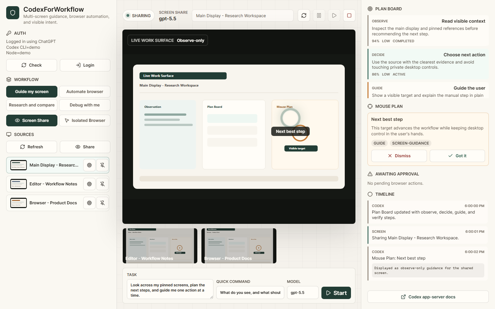
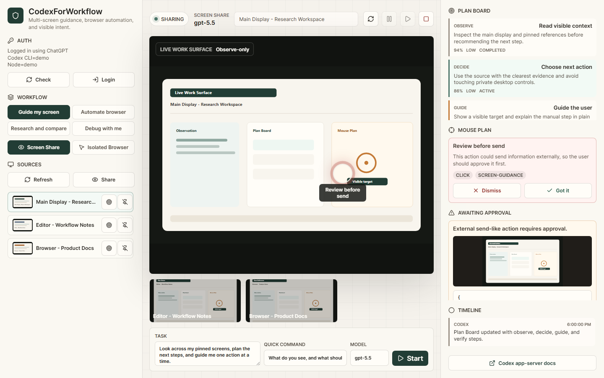

# CodexForWorkflow

CodexForWorkflow is a Windows desktop command center for Codex-guided work across multiple screens. It helps you share screens or windows for observe-only guidance, automate an isolated browser with approvals, preview mouse intent before action, and keep a visible plan while working.

This project is independently built by Andrew Rainsberger. It is not an official OpenAI product and is not affiliated with or endorsed by OpenAI.

## Screenshots

### Pro Command Center



### Safety And Approval Flow



## What It Does

- Multi-screen workspace: refresh, pin, focus, and observe multiple screens or windows.
- Live Work Surface: a primary screen/browser canvas with secondary context strips.
- Screen Share mode: observe-only guidance for the live desktop. It cannot click or type on your desktop.
- Isolated Browser mode: Playwright Chromium automation with human approval for risky actions.
- Mouse Plan: visible target overlays that show where Codex wants the next action to happen.
- Plan Board: Codex-visible observe, decide, act/guide, and verify workflow steps.
- Workflow presets: guide a screen, automate a browser, compare research windows, or debug with an assistant.
- Safety controls: pause, resume, stop, approvals, blocked domains, and credential/download gates.

## License

CodexForWorkflow is open source under the [MIT License](LICENSE).

You can use, copy, modify, publish, distribute, sublicense, and sell copies of the software, as long as the copyright and license notice stay with the software.

## Requirements

- Windows 10/11
- Node.js 22+
- npm 11+
- Codex CLI installed and signed in

Check Codex auth:

```bash
codex login status
```

## Development

```bash
npm install
npm run prepare:browsers
npm run dev
```

## Production Build

```bash
npm run check
npm run package:win
```

Build output is written to `release/`.

## Scripts

- `npm run dev` starts Vite and Electron.
- `npm run start` starts the built Electron app.
- `npm run typecheck` checks renderer and main TypeScript.
- `npm test` runs Vitest.
- `npm run build` compiles Electron main and renderer assets.
- `npm run check` runs typecheck, tests, and build.
- `npm run package:win` builds Windows installer/portable artifacts.

## Safety Model

CodexForWorkflow intentionally separates observation from control:

- Live desktop screen sharing is observe-only.
- Automated clicking/typing is only allowed inside the isolated Playwright browser.
- Sensitive browser flows require approval.
- The local MCP bridge is loopback-only and uses a per-session token.

## Repository

https://github.com/CurioCrafter/CodexForWorkflow
