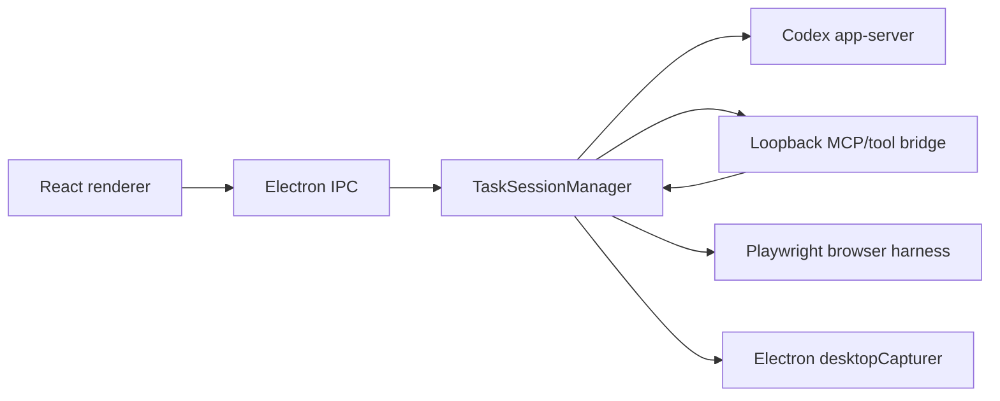

# Architecture

CodexForWorkflow has three main parts:

## Renderer

The renderer is a guided command-center UI:

- left rail for setup: auth, mode, sources, and workflow presets;
- center work zone for the current step banner, live work surface, secondary sources, and Ask Codex bar;
- right rail for Guide, Approvals, Activity, and Details tabs;
- Guide tab for the active Plan Board step, Mouse Plan controls, and step-level actions.

Deterministic demo state powers README screenshots without using real desktop content.

## Main Process

The Electron main process owns privileged work:

- Codex CLI resolution and auth checks;
- Codex app-server lifecycle;
- Playwright browser harness;
- screen source capture;
- policy and approval gating;
- loopback bridge lifecycle.

Renderer follow-ups use local IPC only:

- `task:send-command` sends a follow-up prompt into the active Codex thread.
- `task:observe-current` refreshes the isolated browser or pinned screen-share observations.
- `plan-step:update` records local user progress and advances the next pending step when appropriate.

## Tool Boundary

Screen tools observe only. Browser tools can act only in isolated browser mode. The task manager rejects browser-control tools when the session is in Screen Share mode.
