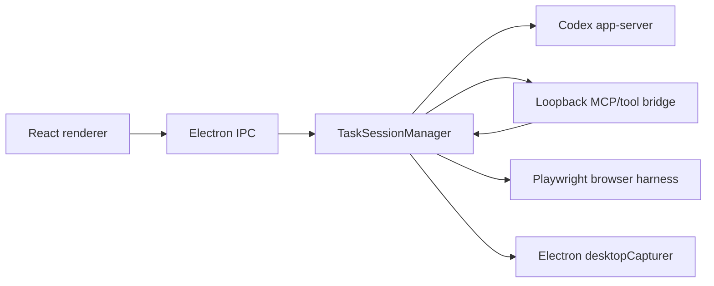

# Architecture

CodexForWorkflow has three main parts:

## Renderer

The renderer is a command-center UI:

- left rail for auth, workflows, and sources;
- center work zone for the live work surface, secondary sources, and command bar;
- right rail for plan board, mouse plan, approvals, and timeline.

Deterministic demo state powers README screenshots without using real desktop content.

## Main Process

The Electron main process owns privileged work:

- Codex CLI resolution and auth checks;
- Codex app-server lifecycle;
- Playwright browser harness;
- screen source capture;
- policy and approval gating;
- loopback bridge lifecycle.

## Tool Boundary

Screen tools observe only. Browser tools can act only in isolated browser mode. The task manager rejects browser-control tools when the session is in Screen Share mode.
